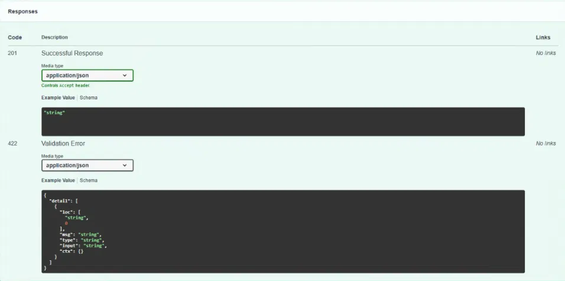

# 📋 The QUEUE — Minimal Task Queue API

**The QUEUE** is a lightweight CRUD API built with FastAPI that manages a to-do list in memory — create, read, update, and delete tasks — paired with a dark, mint-themed interactive frontend.

---

## ⚙️ Features

- 🔁 Full CRUD — Create, Read, Update, Delete tasks
- ✅ Input validation with proper `400` / `404` error responses
- 📄 Interactive API docs via Swagger UI
- 🖥️ Custom dark-themed frontend with animated grid + floating particles
- 🧮 Live done/total task counter
- 🧠 In-memory storage — fast, simple, no database setup required

---

## 🛠️ Tech Stack

- **Python 3** — core language
- **FastAPI** — backend framework
- **Uvicorn** — ASGI server
- **Pydantic** — request validation
- **HTML / CSS / JavaScript** — frontend (vanilla, no framework)

---

## 🧠 Working Principle

The FastAPI server keeps all tasks in a single in-memory list. Every request from the frontend — adding, checking off, or deleting a task — sends a `GET`/`POST`/`PUT`/`DELETE` request to the API, which updates that list and returns the result as JSON. The frontend re-fetches the task list after every action to stay in sync with the server.

---

## 🚀 Run It

```bash
pip install -r requirements.txt
python -m uvicorn main:app --reload
```

Then open:

- **API root:** http://localhost:8000
- **Swagger docs:** http://localhost:8000/docs
- **Frontend (The QUEUE):** http://localhost:8000/app

---

## 📡 API Endpoints

| Method | Path          | Description         |
|--------|---------------|----------------------|
| GET    | `/`           | API info             |
| GET    | `/health`     | Health check         |
| GET    | `/tasks`      | List all tasks       |
| GET    | `/tasks/{id}` | Get one task         |
| POST   | `/tasks`      | Create a task        |
| PUT    | `/tasks/{id}` | Update a task        |
| DELETE | `/tasks/{id}` | Delete a task         |

---

## 🖥️ Swagger UI

Every endpoint above is also testable interactively at `/docs` — no curl required.



---

## 📸 Preview

A minimal dark interface — black background, mint grid lines, softly floating particles, and a live done/total counter.

---

> 🚀 **The QUEUE — Simple. Fast. Organized.**